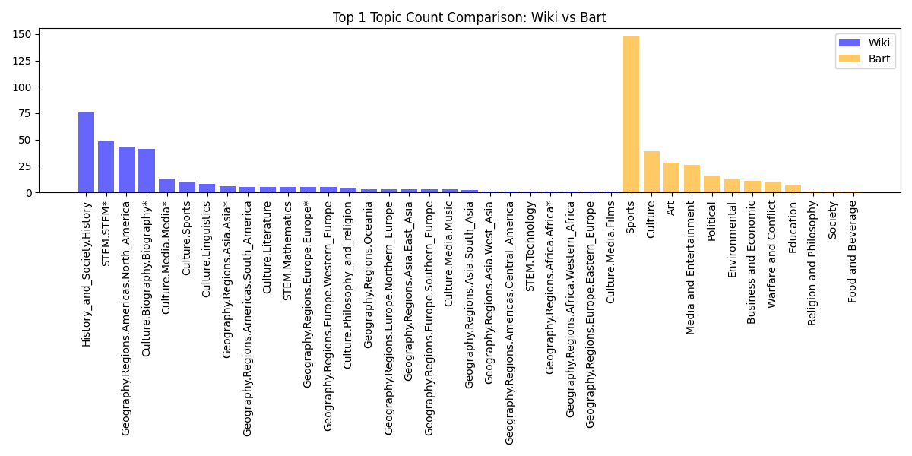
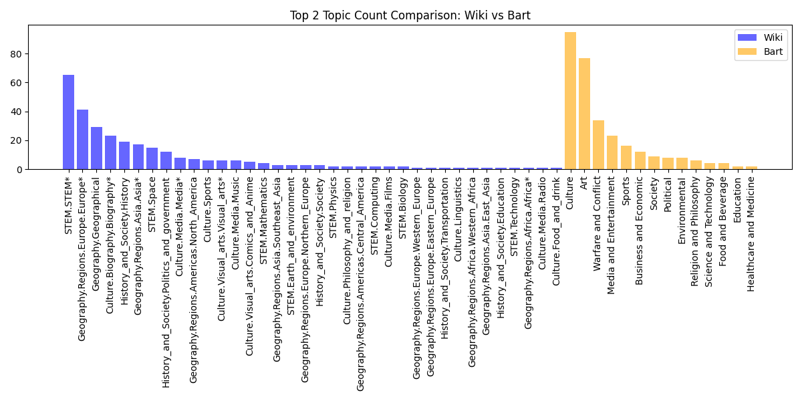
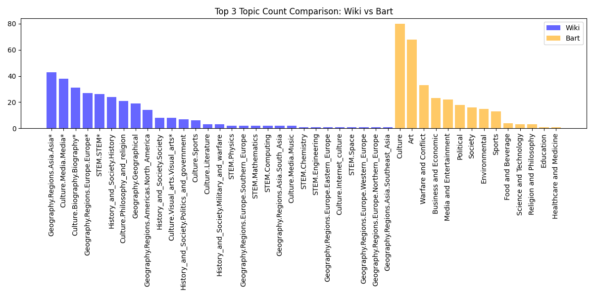

# Topic Prediction Comparison Report

- Top 1 Topic Agreement Rate: 0.0000
- Top 3 Topic Overlap Rate: 0.0000
- Pearson Correlation of Top 1 Scores: nan
- Spearman Correlation of Top 1 Scores: nan
- Wiki Top 1 Topic count saved to: topic prediction comparison results/wiki_top1_topic_count.csv
- Bart Top 1 Topic count saved to: topic prediction comparison results/bart_top1_topic_count.csv
- Disagreements saved to: topic prediction comparison results/disagreements.csv
- Average Kendall’s Tau: -0.7497

## Top 1 Topic Count Comparison

## Top 2 Topic Count Comparison

## Top 3 Topic Count Comparison

